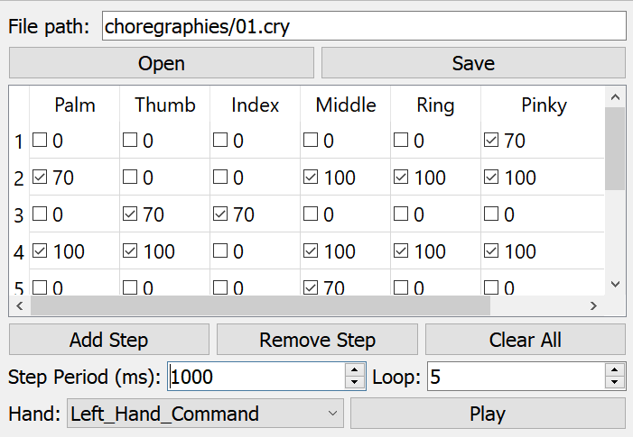

# lslpub_handChoregraph
This program enable to easily create series of hand movement and to publish them as a LSL stream aiming to control the lslsub_handModel.



## Run
Use the lslpub_handChoregraph.exe file in the release directorie.

## Compile/Modify
You can easealy modify or recompile this project by opening it with Qt creator.
Don't forget to uncheck the option "shadow build" in the Project submenu.

## Requirements
On linux be sure to have openGL libraries:
```bash
sudo apt install freeglut3-dev
```